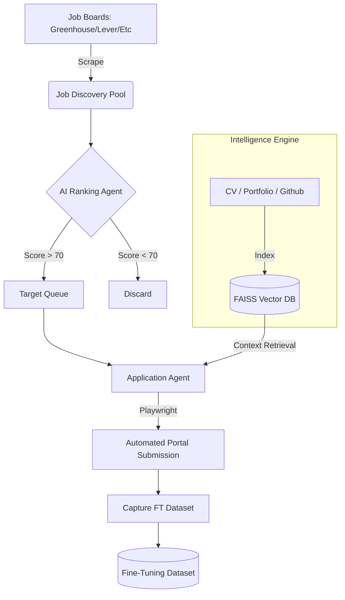

# Job Hunter AI: The Autonomous Career Intelligence Agent 🎯

> **Transforming the Job Search from Manual Labor to Autonomous Intelligence.**

Job Hunter AI is a high-performance, production-grade recruitment engine that automates the entire career lifecycle—from identifying high-value opportunities to intelligently submitting context-aware applications. Unlike simple scrapers, it uses a **Hybrid RAG (Retrieval-Augmented Generation) Architecture** to synthesize answers from your actual career history, portfolios, and codebases.

---

## 📑 Table of Contents
1. [Core Philosophy](#core-philosophy)
2. [Advanced Technical Architecture](#advanced-technical-architecture)
3. [The Intelligence Engine (RAG)](#the-intelligence-engine-rag)
4. [Live Mission Control Dashboard](#live-mission-control-dashboard)
5. [Autonomous Agentic Workflow](#autonomous-agentic-workflow)
6. [Self-Learning & Fine-Tuning](#self-learning--fine-tuning)
7. [Installation & Setup](#installation--setup)
8. [Usage Guide](#usage-guide)
9. [Project Structure](#project-structure)

---

## 🏛️ Core Philosophy
The modern job market represents an information asymmetry problem. Job Hunter AI levels the playing field by applying **Agentic Reasoning** to the application process. 
- **Zero Hallucination Policy**: Uses strict RAG to ensure every claim in an application is backed by your actual uploaded documents.
- **Contextual Synthesis**: Dynamically maps job requirements to your most relevant achievements.
- **Visual Transparency**: Provides a real-time window into the AI’s decision-making process through a premium dashboard.

---

## ⚙️ Advanced Technical Architecture

### 🏗️ System Workflow Diagram


### 🧠 The "Brain" (RAG Service)
The system utilizes a persistent **FAISS (Facebook AI Similarity Search)** vector database to manage your professional persona.
- **Multi-Modal Ingestion**: Simultaneously parses PDF CVs, Markdown Portfolios, and Plain-text GitHub project summaries.
- **Recursive Character Splitting**: Optimizes document chunks (500 tokens) to ensure precise semantic retrieval of achievements.
- **Contextual Retrieval**: When an application asks "Describe your experience with ETL," the brain retrieves the exact 5 most relevant segments of your history to construct the answer.

### 🤖 The Agent (Application Agent)
Powered by **Playwright**, the agent handles:
- **Dynamic DOM Parsing**: Uses LLMs to "see" the webpage and map input fields (Text, Select, Radio) to candidate data points.
- **Smart Form Filling**: Intelligently identifies "Tricky" questions (e.g., diversity surveys, salary expectations) and answers them based on configured preferences.
- **Validation Handling**: Detects missing fields or errors in real-time, attempting auto-correction before submission.

---

## 📡 Live Mission Control Dashboard
Built with **Streamlit**, the dashboard is your high-fidelity "Command Center" for the agent.

- **🏠 Command Center**: Real-time stats on jobs discovered, ranked, and applied.
- **🧠 RAG Intelligence**: A simulator to test exactly how the AI will answer specific questions using your CV context.
- **📡 Live Mission Control**: A non-technical, visual feed of the AI's "brain activity"—including a live chart of AI suitability scores as it evaluates roles.
- **📄 Applications Tracker**: Track every success and failure with detailed reasonings (e.g., `captcha`, `validation_error`).
- **📝 Document Generator**: Instantly generate tailored ATS-optimized resumes and cover letters for a specific JD on-demand.

---

## 🔄 Autonomous Agentic Workflow

1. **Discovery**: Scrapes Greenhouse, Lever, Workday, and other sources for roles matching your keywords.
2. **AI Ranking**: GPT-4o-mini evaluates the Job Description against your persona, assigning a score from 0-100.
3. **Context Retrieval**: The RAG engine pulls relevant facts from your vector database to ground the response.
4. **Form Synthesis**: The agent navigates the application portal and fills out every field (including complex open-ended questions like "Why work here?").
5. **Verification**: Captures screenshots of the process for your review and maintains a persistent JSONL log of every interaction.

---

## 📈 Self-Learning & Fine-Tuning
Every time the agent answers a form question, it logs the **Prompt + Context + Response** into a `finetuning_dataset.jsonl` file.
- **Automatic Data Collection**: Builds a high-quality dataset of your unique application style.
- **Self-Optimization**: This data can be used to fine-tune a custom GPT model, making the agent faster, cheaper, and 100% aligned with your personal "professional voice" over time.

---

## 🛠️ Installation & Setup

### Prerequisites
- Python 3.11 or higher
- [Playwright](https://playwright.dev/)
- OpenAI API Key

### Quick Start
```bash
# Clone the repository
git clone https://github.com/the candidate9/Job-Hunter
cd Job Hunter

# Install dependencies
pip install -r requirements.txt

# Install browser binaries
playwright install chromium

# Set up your environment
# Create a .env file and add your OPENAI_API_KEY
```

---

## 🚀 Usage Guide

### 1. Launch the Live Dashboard
```bash
streamlit run dashboard/streamlit_app.py
```

### 2. Run the Autonomous Pipeline
```bash
# Process up to 50 jobs with a minimum suitability score of 50
python -u -m app.fast_pipeline --mode auto_safe --top 50 --min-score 50
```

### 3. Build/Update your Knowledge Base
Simply drop your latest CV, Portfolio links, or Project descriptions into the `data/cv/`, `data/portfolio/`, or `data/github_exports/` folders. The RAG engine will automatically re-index them into the FAISS database on the next run.

---

## 📂 Project Structure
```bash
├── app/
│   ├── agents/          # Agent logic (Ranking, Application, Document Gen)
│   ├── services/        # Core utilities (RAG, LLM, Browser Management)
│   └── config/          # Central configuration & Constants
├── dashboard/           # Streamlit Dashboard source code
├── data/                # Your Knowledge Base (CV, Portfolio, Project Exports)
├── generated/           # Output artifacts (Logs, Tailored Docs, Screenshots)
└── requirements.txt     # Python dependencies
```

---
*Built with ❤️ by Your Name. Powering the future of autonomous career development.*
